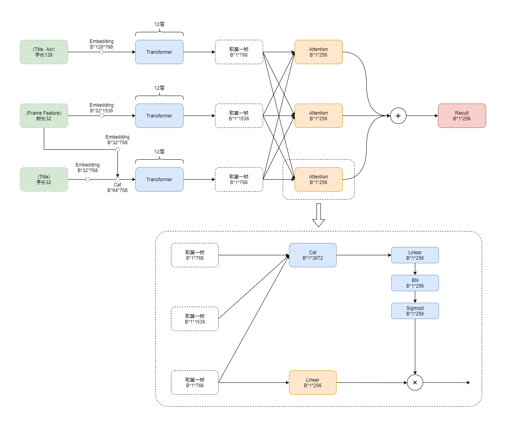
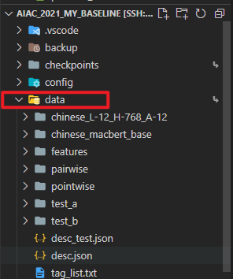
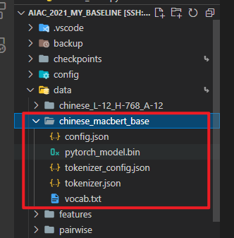
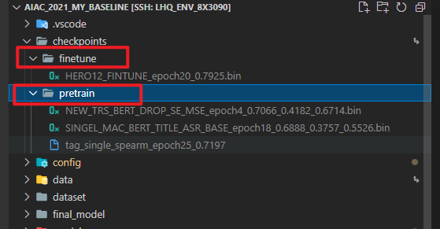

# AIAC2021赛道一 Rank 15

[https://algo.browser.qq.com/](https://algo.browser.qq.com/)

## 目录说明

```shell
checkpoints/          训练模型保存文件
data/                 数据集
config/               配置文件
dataset/              数据读写相关
final_model/          最终融合模型
model/                模型定义相关
result/               中间文件以及结果文件
utils/                工具类以及方法
pic/                  README图片存储
data_analysis.ipynb         数据分析文件
val_tsv.ipynb               Pairwise数据划分文件
pretrain_bert.py            macbert文本模型预训练
pretrain_transformer.py     transformer视频模型预训练
pretrain_hero.py            transformer文本视频模型预训练
finetune_bert_trs_hero.py   三模型融合finetune
common_evalue.py            验证预训练模型或者finetune模型
common_test.py              生成test结果
```

## 模型介绍

1. 通过Bert提取文本特征
2. 通过Transformer提取视频特征
3. 通过Transformer提取视频文本融合特征
4. 三种特征通过Attention进行加权融合得到最终embedding

整体预测流程图如下图所示


### 预训练

其中文本Bert预训练，视频Transformer预训练各自是单独通过对tag 10000类多标签预测完成，最后一个transformer预训练则同时输出文本以及视频特征通过对tag 10000类多标签预测完成。总的来说就是一个模型提取文本特征，一个模型提取视频特征，一个模型提取视频和文本的交互特征。

### finetune

> finetune过程中冻结所有训练模型参数

finetune则是通过attention机制加权融合三个预训练模型提取的特征，随后预测pairwise视频对的score，计算mse loss实现训练。

## 前期准备

### 代码下载

[代码下载连接](https://share.weiyun.com/l7rgfQvi)，下载其中的`code.zip`

下载后解压到对应目录

### 安装依赖

```shell
pip install -r requriements.txt
```

### 链接数据集

```shell
ln -s xxx/xxx/data ./
```

把数据集链接到本项目文件夹下



并在data文件夹中新建`desc_test.json`文件，如上图所示

```json
{
  "id": "byte",
  "tag_id": "int",
  "category_id": "int",
  "title": "byte",
  "frame_feature": "bytes",
  "asr_text": "byte"
}
```

### 下载文本预训练模型

[macbert下载连接](https://share.weiyun.com/l7rgfQvi)，下载其中的`chinese_macbert_base.zip`

下载macbert预训练模型并放置于data目录下，放置后目录结构如下图



### 下载checkpoints

[checkpoints下载连接](https://share.weiyun.com/l7rgfQvi)，下载其中的`checkpoints.zip`

下载checkpoints预训练模型并放置于根目录下，放置后目录结构如下图



## PRETRAIN

> 如果不需要预训练则跳过本步骤

### bert预训练

配置文件位于:`config/bert_pretrain_config.yaml`

```shell
python pretrain_bert.py
```

### transformer预训练

配置文件位于:`config/trs_pretrain_config.yaml`

```shell
python pretrain_transformer.py
```

### hero预训练

训练配置文件位于： `config/hero_pretrain_config.yaml`

模型配置文件位于： `config/hero_pretrain.json`

```shell
python pretrain_hero.py
```

## FINETUNE

> 本项目finetune过程使用的都是在预训练过程中spearman最高的模型

> 如果不需要finetune则跳过本步骤

配置文件位于:`config/hero_finetune_config.yaml`

注意配置以下预训练模型的存储路径：

```yaml
TAG_FRAME_TRS_CONV: checkpoints/pretrain/xxx.bin
TAG_TITLE_ASR_BERT:  checkpoints/pretrain/xxx.bin
HERO: checkpoints/pretrain/xxx.bin
```

```shell
python finetune_bert_trs_hero.py
```

## TEST

配置文件位于:`config/test.yaml`

注意配置以下`TESTING.CHECKPOINT`路径:

```yaml
TESTING:
  BATCH_SIZE: 512
  SAVE_PATH: result/result.json
  CHECKPOINT: checkpoints/finetune/xxx.bin
```

最终使用模型路径为`checkpoints/finetune/HERO12_FINTUNE_epoch20_0.7925.bin`，本地验证spearman为0.7925，线上为0.82155

```shell
python common_test.py
```

代码会自动生成并压缩结果文件，存储于`result`文件夹中
